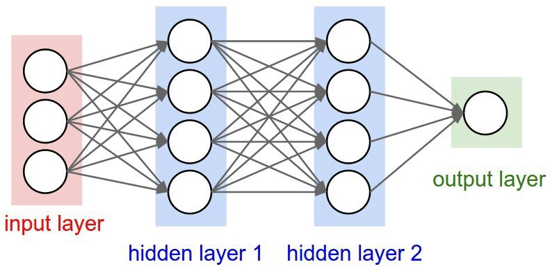
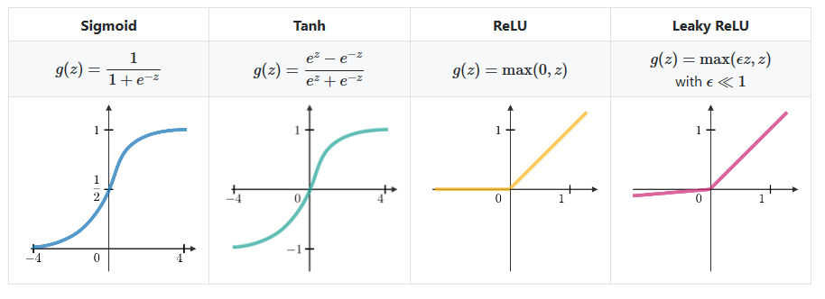
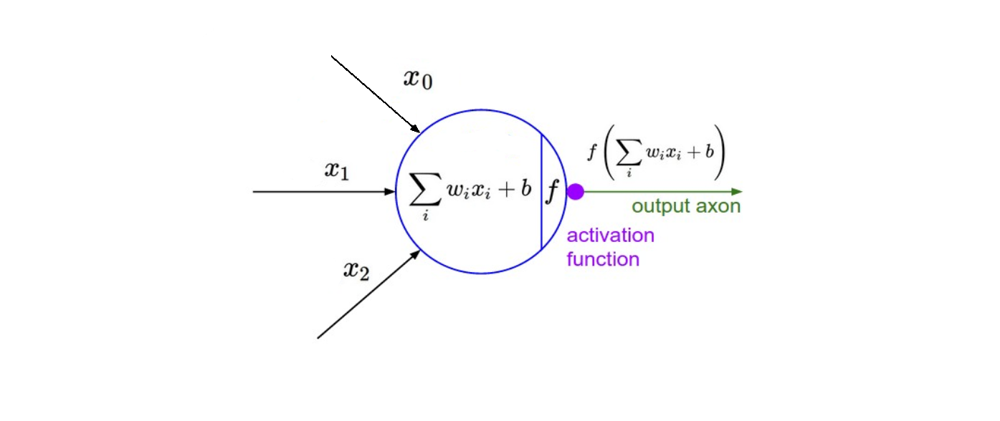
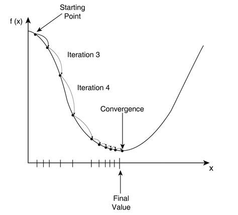

# DeepLearning
Deep learning is an area of machine learning focus on using deep which contains more than one hidden layer of Artificial Neural Networks, which are inspired by the human brain.Deep learning is applicable over a range of fields such as computer vision, speech recognition, natural language processing.

**Artificial Neural Network**
ANN's are inspired from biological neural processing network of Neurons in our brain.Basically a neron takes inputs through dentrides, process the information and send output through axons.Connections between neurons take place through synapses.Below diagram of biological neuron of brain.                        
         

                            

A neuron cell in ANN is called Perceptron. It has no hidden layer and it can give single output.
                  

  
                  
A network of perceptrons with a hidden layer is called Artificial Neural Network. Neural Network having more than one hidden layer is called deep neural network.
                 

**_Activation Function_**
Activation functions are used at the end of a hidden unit to introduce non-linear complexities to the model. Here are the most common ones:

**_Learning Rate_**
The learning rate, often noted α or sometimes η indicates at which pace the weights get updated. This can be fixed or adaptively changed. The current most popular method is called Adam, which is a method that adapts the learning rate.

**_Cost Function_**
Cost functions are used to minimize the errors to improve the accuracy of the model. The model improves the training accuracy by minimising the errors using cost functions. There are many cost functions available such as MeanSquareError,MeanAbsoluteError,cross-entropy etc.
         

 **_Gradient Descent_**
Gradient descent is an optimization algorithm used in machine learning to learn values of parameters that minimize the cost function. It’s an iterative algorithm, in every iteration, we compute the gradient of the cost function with respect to each parameter and update the parameters of the function.

_Stochastic Gradient Descent_
Uses only single training example to calculate the gradient and update parameters.

_Batch Gradient Descent_
Calculate the gradients for the whole dataset and perform just one update at each iteration.

_Mini-batch Gradient Descent_
Mini-batch gradient is a variation of stochastic gradient descent where instead of single training example, mini-batch of samples is used. It’s one of the most popular optimization algorithms.  

 

