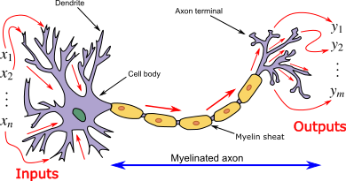
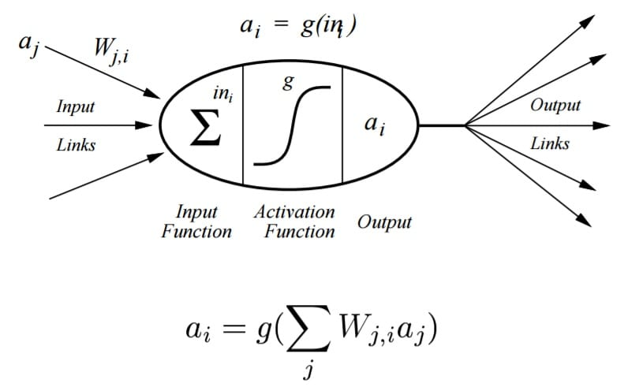

# DeepLearning
Deep learning is an area of machine learning focus on using deep which contains more than one hidden layer of Artificial Neural Networks, which are inspired by the human brain.Deep learning is applicable over a range of fields such as computer vision, speech recognition, natural language processing.

**Artificial Neural Network**
ANN's are inspired from biological neural processing network of Neurons in our brain.Basically a neron takes inputs through dentrides, process the information and send output through axons.Connections between neurons take place through synapses.Below diagram of biological neuron of brain.                        
         

                            

A neuron cell in ANN is called Perceptron. It has no hidden layer and it can give single output.
                  

  
                  
A network of perceptrons with a hidden layer is called Artificial Neural Network. Neural Network having more than one hidden layer is called deep neural network.
                 

